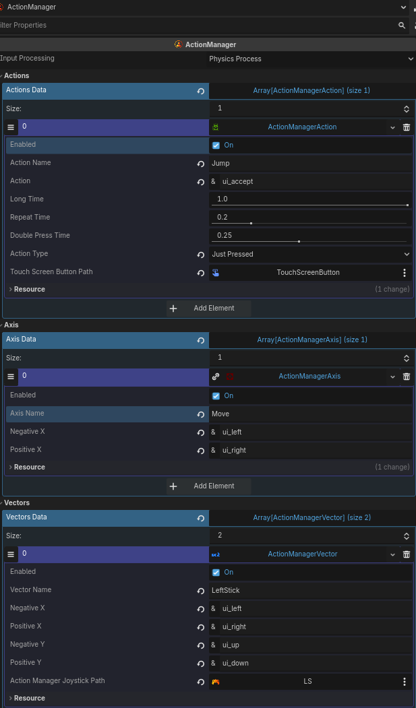

# Action Manager for Godot 4.x

The **Action Manager** is a robust solution for managing inputs in the Godot Engine. It extends the native system to support complex behaviors and offers seamless integration for mobile controls (TouchScreenButtons and Joysticks), injecting events directly into the global Input system.

---

## Main Features

- **Advanced Trigger Types:** Configure double clicks, long presses, repetition, and toggle states without writing an extra line of code.
- **Native Mobile Bridge:** Connect `TouchScreenButton` and `ActionManagerJoystick` nodes directly to your Input Map actions.
- **Input Injection:** The plugin simulates real keyboard/controller events, allowing your game logic to remain the same for PC and Mobile.
- **Editor Validation:** Automatic alerts (Configuration Warnings) help identify configuration errors or non-existent action names.

---

## Supported Action Modes

Each action can be configured with one of the following behaviors:

| Mode                | Description                                                        |
| ------------------- | ------------------------------------------------------------------ |
| **PRESSED**         | Continuously active while the key is pressed.                      |
| **JUST_PRESSED**    | Fires only one frame at the moment of the click.                   |
| **RELEASED**        | Fires the moment the key is released.                              |
| **TOGGLE**          | Toggles between on/off with each full click.                       |
| **LONG_PRESS**      | Fires once after holding for `long_time`.                          |
| **LONG_PRESS_HOLD** | Activates after `long_time` and remains active while held.         |
| **REPEAT**          | Fires repeatedly at `repeat_time` intervals while held.            |
| **DOUBLE_PRESS**    | Activates only if there are two clicks within `double_press_time`. |

---

## How to Configure

1. **Add the Node:** Instantiate the `ActionManager` node (a `CanvasLayer`) in your scene.
2. **Define the Processing:** In the Inspector, choose between `Physics Process` (recommended) or `Process`.
3. **Create the Resources:**
   - **Actions Data:** For simple or complex buttons (Jump, Dash, Attack).
   - **Axis Data:** For 1D axes (Lateral movement, Zoom).
   - **Vectors Data:** For 2D movement (WASD, Arrow keys, or Joysticks).

---

## Example Script

Access the inputs in a simplified way on your character:

```gdscript
extends CharacterBody2D

@onready var action_manager = $ActionManager

func _physics_process(delta: float):

    # Obtaining a Vector2 (works with Keyboard or Virtual Joystick)
    var move_dir = action_manager.get_vector("Movement")
    velocity = move_dir * 300
    move_and_slide()

    # Checking for a double click for Dash
    if action_manager.get_action("Dash"):
        print("Double Click Dash!")

    # Checking for a Toggle mode for Flashlight
    if action_manager.get_action("Flashlight"):
        $SpotLight2D.enabled = true
    else:
        $SpotLight2D.enabled = false
```

---

## Mobile Support

### TouchScreenButtons

Inside an **ActionManagerAction**, point the **touch_screen_button_path** to your button node. The Action Manager will then handle that button's events, enabling modes like Long Press or Double Press on touch devices.

### Virtual Joystick

1. Add the ActionManagerJoystick node to your UI.
2. In your Vector Data resource, select this joystick in the action_manager_joystick_path field.
3. The plugin will automatically convert joystick movement into directional inputs, injecting strength values (0.0 to 1.0) into the configured actions.

---

## Class Structure

`ActionManager`: The core (CanvasLayer) that processes and validates data.

`ActionManagerAction`: Resource for button behaviors and Touch integration.

`ActionManagerAxis`: Resource for axis mapping (float).

`ActionManagerVector`: Resource for directional mapping (Vector2) and Joystick support.

---

## Screenshots



---

## ❤️ Support

### If this project helped you, please consider supporting it:

Github Sponsors: https://github.com/sponsors/Saulo-de-Souza

Paypal: https://www.paypal.com/donate/?hosted_button_id=G24W4KL9ALH64
